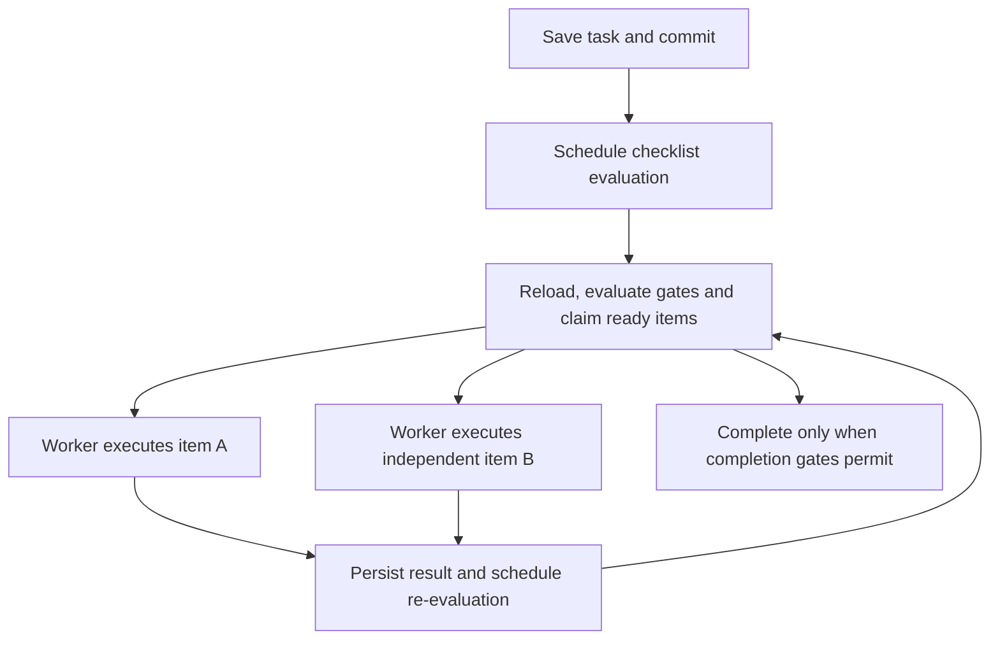

# Common workflow framework: tasks, checklists and AI execution

Design record, 16 September 2026. Source baseline: CounselKit platform `11.5.x`
(local inspected revision `d9f66a2ce9`) and Common `2.x`.

This document records the scope and architectural direction discussed during the
task port. It distinguishes implemented foundations, agreed requirements and
proposals that still need validation. It is not a claim that the framework below
has already been built.

The phased delivery plan is [Workflow implementation plan](WORKFLOW_IMPLEMENTATION_PLAN.md).

## Purpose and scope

The priority is to give **rlmumford/common a reusable workflow framework** before
choosing how Christian Jobs integrates it. CounselKit 11.5's task/checklist
execution framework is the behavioral baseline. This is substantially more than
adding task entities and a few checklist plugins.

Christian Jobs initially exposes work to internal staff, but that restriction
belongs in the consuming application. Common must support other users later.
Phone, chat and legal-domain integrations are outside this port. The generic
resource pane, operation APIs and AI execution infrastructure remain in scope;
they must not require those integrations.

This is the canonical architecture record for Common's checklist framework and
its task, service and AI integrations. Application-specific integration notes
belong in the consuming application's repository. Common remains the source of
truth for code; split package repositories are publishing outputs.

## Decisions and proposals

| Topic | Position |
| --- | --- |
| Primary deliverable | Common's reusable framework; defer further Christian Jobs integration. |
| Behavioral baseline | CounselKit `11.5.x`, including checklist processing, interfaces and supporting integrations. |
| Field names | Entity-scoped, unprefixed names such as `dependencies`, `service` and `resolved`. |
| Outcomes | Durable outcomes belong on checklist items; no duplicate task-level outcome store is required. |
| Intermediate state | Separate mutable working state from outcomes. Confirmed: retain state on failure; resume and start-fresh create separate attempts, with start-fresh clearing working state and preserving history. |
| Operational history | Required. Record execution identity, attempts, transitions and results. |
| Configurable recovery framework | Out of scope; it has not proved useful in practice. Basic retry/reset behavior remains necessary. |
| Typed-data dependencies | Preferred and agreed direction: move shared fetching/filtering and condition evaluation below Entity Template into TypedDataPlus. Verify exact extraction boundaries in code. |
| Distribution | Keep the existing GitHub packages while APIs settle. Drupal.org publication is deferred, not a prerequisite for development. |
| AI reuse | Recommended: Drupal AI provider/tool infrastructure plus our durable run and checklist integration. Validate the agent-loop boundary before adoption. |
| Background execution | Recommended: a generic execution interface with a Messenger adapter. Prove this before replacing existing queues/runners. |
| Deployment | Recommended: separate web and worker containers using the same application image. Co-location is also possible. |

## Package boundaries

Names for new AI/execution modules below describe responsibilities, not committed
repository or Drupal module names.

| Package or integration | Responsibility |
| --- | --- |
| `typed_data_plus` | Existing reference/context-assignment submodules; proposed shared extended data fetcher, navigation, filters and condition-string evaluator. Views checks should be an optional integration. |
| Entity Template | Template execution and components, including component conditions using the shared evaluator. |
| `checklist` | Item plugins, three execution interfaces, outcomes, intermediate state, processing, history, resources, templates/derivatives and execution abstraction. |
| `task` / job submodules | Work entities, scheduling, task dependencies/roots, job configuration, assignment, task context and checklist integration. |
| `service` | Work containers and their lifecycle; integration that gates associated tasks. |
| `note` | Existing comment/discussion storage. |
| Checklist Messenger integration | Dispatch, delayed work and worker handlers invoking checklist execution. |
| AI run infrastructure | Durable sessions/runs, messages, status, identity, result retrieval and cancellation. |
| Task/checklist AI integration | Task-owned sessions, context/tool restrictions, suspension and outcome application. |
| Drupal AI / provider modules | Provider APIs and normalized model requests/responses. |
| Tool adapters | Expose checklist operations to Drupal's Tool API/AI tooling without duplicating their business logic. |

The shared fetcher and evaluator must not depend back on Entity Template if Entity
Template consumes them. Otherwise component conditions create a circular dependency.
Checklist-specific contexts and predicates extend the evaluator from checklist/task.
Use the existing extended Entity Template fetcher and its filters as the starting
point. Do not introduce another placeholder/property-path interpreter. The D7
placeholder path is replaced by typed-data navigation/fetching in this design.

TypedDataPlus currently packages `typed_data_reference` and
`typed_data_context_assignment` as independently enabled submodules, preserving
module names and configuration. The new responsibilities above are not implemented.

Composer reads custom repositories from the root project. Until distribution is
resolved, consumers must declare the GitHub repositories. Do not release public
Entity Template versions requiring a package that ordinary consumers cannot resolve
without addressing that requirement. Drupal.org naming, ownership and maintenance
expectations need a deliberate decision, not an incidental consequence of extraction.

## Task and service lifecycle

Tasks require start, due and external-deadline date/time fields, assignees and
assignment policies, a service reference, a root task, dependencies, resolution
and a reliable resolution timestamp. A task root groups lineage/discussion; it is
not the same relationship as a service container or a dependency.

Required behavior:

- A future start date or a draft service prevents activation.
- Any dependency that is not resolved blocks the task.
- Dependency resolution and service activation re-evaluate affected tasks.
- Pending, active, dependency-blocked and manually held work must remain
  distinguishable. Final machine values and precedence when several gates apply
  still need specifying.
- Resolution timestamps must be enforced on every resolution path, including
  direct edits and APIs, not only a convenience `resolve()` method.
- Services need Draft, In Progress/Active, Complete, Cancelled and Superseded.
  Superseded is distinct from cancellation, including its side effects and reporting.

Decide explicitly what happens to tasks when a service is completed, cancelled,
superseded or returned to draft; what reopening means for timestamps/history; and
whether any legacy `closed` task status remains. The user's dependency rule is
strictly **resolved**, so treating `closed` as equivalent is not the agreed behavior.

The current Common foundation has the date fields, dependencies, root, service
reference, basic assignment and scheduling. It currently marks dependency-blocked
work pending, accepts closed prerequisites, has only a boolean service state and
no service-activation gate. Those are implementation gaps, not the target model.

### Nested services

Nested services are an explicit requirement. Common already stores a parent service
in the service entity's `service` reference and exposes computed `root` and `all`
properties on service references. Build on this model, with cycle prevention,
safe traversal, reparenting rules, descendant cache invalidation and access checks.
Keep service ancestry separate from task roots and task dependencies.

Task readiness is gated only by the immediate service. Ancestor statuses do not
independently gate descendant tasks, and parent transitions leave child statuses
unchanged unless an explicit workflow changes them. Manager fallback, permission
inheritance and deletion behavior are specified in the Phase 0 contract. Nesting
alone must not silently grant access or cascade cancellation. The implementation plan's
P2 defines the hierarchy work and its acceptance criteria.

## Checklist contracts

### Three execution paths

Each applicable plugin can provide:

1. **Action methods** for automatic execution.
2. **Action forms** for human interaction.
3. **Action operations** with discoverable names and validated parameter schemas,
   usable by APIs and AI tools, including state-dependent operations and callbacks.

All three paths must use shared business logic and enforce equivalent execution
gates. A hidden form/button is not authorization. Preserve expected-outcome
contracts, intrinsic contexts and configuration-dependent contexts, so configuration
tools know what data will exist before an item has run.

Machine-readable configuration schemas and operation schemas are part of the
framework. Adapt the D7 declarations to Drupal's plugin/configuration mechanisms;
do not simply copy the D7 compatibility layer.

### Conditional strings

The evaluator and integrations are prerequisites for checklist processing. Inventory
11.5's grammar and integration points before implementing a subset. Required areas
include boolean composition, item status, outcomes, typed-data property/filter
expressions, current execution-user context and Views-result checks with contextual
arguments. Define the identity and access context used for Views execution.

Use this shared mechanism for dependencies, applicability, requiredness,
actionability, decision-option availability, assignment policies and completion
conditions. Preserve validation and explanations of unmet gates. Missing outcomes
or not-yet-generated items must have explicit semantics; they must not accidentally
release work. Invalidate cached condition results after relevant mutations.

### Decisions and dynamic checklists

Decision plugins need named options, availability conditions checked again at
execution, durable decision outcomes and downstream conditions consuming them.
Jobs can declare named checklist templates for static inclusion and decision-driven
expansion. These are reusable framework features, independent of AI decisions.

The 11.5 implementation also includes:

- Providers that assemble and alter item sets.
- Parent/local scopes, generated names and local dependency rewriting.
- Nested derivative items, with recursion limits and diagnostics.
- Refresh/diff behavior for additions, removals and applicability changes.
- Virtual generated items that need not be persisted before interaction.
- Reconciliation: unpersisted items can disappear; persisted work whose generating
  branch disappears is preserved as orphaned, with restoration support.

Do not reduce this to append-only rows. Repeated expansion must not duplicate items
or overwrite existing state/outcomes. Newly required items must participate in the
same processing and completion calculation immediately. UI updates must insert or
remove rows without requiring a page reload.

### Resource workspace

Provide the split checklist/action area and contextual resource pane in the reusable
modules. Support job/default resources and item-defined resources, shared resource
keys, focus and refresh behavior after actions, and access/cache metadata on every
resource. Phone/chat-specific resources are excluded, not the generic pane contract.

### State, outcomes and history

| Data | Purpose and proposed lifecycle |
| --- | --- |
| Item state | Mutable intermediate data across requests, forms, API operations and retries; includes pending run references. Normally removed after success. |
| Item outcomes | Durable workflow results consumed by contexts and conditions. |
| Execution history | Durable attempts, initiator/executor, timestamps, transition reasons, completion method and failure information. |

CounselKit 11.5 currently clears intermediate state on **failure as well as success**.
The confirmed Common behavior retains state on failure. Explicit resume creates a
successor attempt using retained state; start-fresh creates a new attempt with empty
working state. Both preserve history, including the failed attempt. Successful
completion clears working state. Reset/reopening rules are specified in the
[Phase 0 contract](WORKFLOW_PHASE_0.md).

Do not automatically turn a failed state's contents into an outcome. That would mix
working data with valid workflow results and could expose credentials, temporary
URLs or sensitive context. If needed, an opt-in redacted diagnostic snapshot belongs
with restricted attempt history and a defined retention policy. This is a proposal,
not an agreed requirement to capture snapshots.

Preserve attempted/failure/completion metadata and useful explanations of blocked
work. Exclude the elaborate per-item configurable recovery framework. Basic
retry/reset and failure visibility are still required.

## Processing and parallel execution

The processor must preserve applicability, requiredness, dependencies, actionability,
execution identity, queued/failed states and explicit checklist completion conditions.
Audience filtering is a presentation concern: hidden items still participate in
processing and completion. Hidden automatic work must be able to progress.

Recommended execution flow:

Parallelism comes from independent worker processes and persistent attempts, not
in-memory PHP promises surviving request boundaries. The dispatcher must claim work
atomically and coalesce redundant evaluations without losing a later state change.

- Save first; enqueue safely after commit. Choose a transactional outbox or another
  reliable handoff so a crash cannot strand committed work before dispatch.
- Recheck stored status and gates after acquiring the execution claim. A stale
  message must not execute an item that has already completed or been cancelled.
- Keep processing and form-edit locks distinct. Long external operations need
  suitable lease duration/renewal. Lock contention must not imply completion.
- Do not hold a whole-task database transaction/lock during slow work. Persist item
  results independently and use short coordination locks for task-level decisions.
- No dependency does not necessarily mean safe parallelism: two items may edit the
  same entity or external resource. Define serialization keys/exclusive operations.
- Reload before applying changes; avoid saving stale whole-entity snapshots over
  concurrent edits. End-to-end exactly-once external effects are not provided by a
  queue: use operation identities and downstream idempotency where available.
- Processor-originated saves must not trigger endless evaluation dispatch loops.

Default parallelism and the conflict/serialization contract require explicit design
and tests before enabling concurrent execution broadly.

### Execution identity

Record the initiating user separately from the executing user. Resolve the executor
under an explicit policy (caller, assignee or configured automation account), not the
ambient cron user. Record the selected identity and recheck its account/access when
work starts; define whether reassignment invalidates a queued attempt.

Use Drupal's account switcher around execution, restoring the original account in
`finally`. This supplies current-user context; it is not a browser session and does
not replace entity/operation access checks. Propagate identity and scope through
follow-up messages and AI tool calls. Reset per-message context in persistent workers
so one job cannot inherit another's identity or cached authorization.

## Drupal AI comparison and proposed reuse

The review inspected AI **1.4.8**, AI Agents **1.3.5**, newer AI branch sources and
CounselKit `11.5.x`. These findings are source review, not an installed interoperability
or load test. Pin and revalidate versions when implementation starts.

| Concern | Drupal ecosystem | Porting direction |
| --- | --- | --- |
| Providers and model operations | Provider plugins, normalized chat/tool calls and streaming. | Reuse Drupal AI instead of duplicating provider adapters. |
| Agent loop and tools | Configurable agents, sub-agents, iteration limits and serializable state. | Evaluate reuse behind our execution boundary. |
| Multi-request continuation | AI Agents supports one-loop execution and state export/import; Assistant API stores unfinished agents in private tempstore. | Useful primitives, not equivalent to durable task-owned runs. |
| Durable workflow ownership | No equivalent task/checklist ownership contract found in the inspected stable stack. | Port sessions/runs tied to tasks and named item/component scopes. |
| Scheduling/cancellation | Generic worker facilities exist separately from AI providers. | Preserve run status, claims, expiry and terminal-state guards. |
| Tools and access | Drupal tool infrastructure exists. | Adapt checklist operations; retain live task/user scope and per-run allowed-tool restrictions. |
| Progress | Agent events and polling service. | Reuse where useful; retain durable history, messages and work attribution. |
| Usage | Provider usage data is available where supported. | Preserve attribution to run/session/task/service and the consuming application's organization scope. |

Tool API is a promising integration point for typed inputs/outputs and operation
exposure. At review time it was beta; keep the adapter optional while validating it.
The separate AI Runtime project targets asynchronous agent execution and stored
history, but was not accepted as a dependency: its release/API compatibility with
Runner still needs proving. Do not confuse it with the stable provider layer.

Retain clear separation between:

- A conversation with several user turns.
- Several model/tool iterations that can yield between requests.
- One provider call that exceeds PHP-FPM's request timeout.

The first two do not solve the third. The slow call must execute outside the web
request, or use a provider-specific asynchronous job API where supported.

CounselKit's current limits also matter: automatic checklist items resume through
background processing; interactive items normally reconcile through form polling or
reopening. Browser-closed completion is not universally provided. Duplicate tool
calls are detected, but complete result bodies are not replayed. Concurrent human
turns on a single item's state are outside its existing contract. Port these
consciously rather than assuming stronger guarantees.

## Messenger and deployment

Messenger would be a shared background executor for both AI and ordinary checklist
actions. It supplies transport/worker/retry machinery; our framework supplies run
records, result retrieval and workflow correctness.

### Bounded wait

Preserve CounselKit's fast path:

1. Persist the run and dispatch asynchronously after it is visible to the worker.
2. A worker executes it independently.
3. The web request polls persisted status for a small budget, for example one second.
4. Return a completed result if available; otherwise return a run ID and continue
   through later requests.

Always start in the worker. Do not start synchronously and attempt to detach a
running provider call after the budget expires. Messenger does not automatically
return an asynchronous handler's result to the original request; our facade owns
this behavior. The bounded wait still occupies a web worker briefly.

An always-running consumer with available capacity is needed for useful short waits.
Cron-only worker startup adds scheduling latency. Browser batch processing, web cron
and streaming do not bypass FPM's hard termination limit for a single long call.

### Infrastructure choices

| Choice | Trade-off |
| --- | --- |
| Web and supervised CLI consumer in one container | Simple local/small deployment; shared resources and lifecycle. |
| Separate web and worker containers using the same image | Preferred production starting point; one codebase, independent resources and lifecycle. |
| Several worker replicas/pools | More concurrency; isolate long AI work from short checklist work. |

The worker is PHP CLI, not another PHP-FPM request. Container placement is deployment
configuration; installing Messenger does not provision or supervise workers.
Workers require shared database/transport access, required files and credentials,
compatible application versions, deployment restarts and graceful shutdown handling.
The reviewed stable Drupal Messenger release provides SQL transport, so a separate
broker is not mandatory initially. Redis/AMQP or another transport can be evaluated
when justified. Set HTTP timeouts, leases, concurrency and retry limits deliberately.

Existing Drupal Queue API producers can be migrated through Messenger interception.
Intercepted queues are then consumed by Messenger, not Drupal cron or `drush
queue:run`. System cron can launch a bounded Messenger consumer if always-running
workers are unavailable. Choose one execution route per queue.

## Implementation sequence and proof requirements

1. Inventory 11.5 contracts and map dependencies. Extract the shared typed-data
   fetcher/filter/evaluator path; validate the package dependency direction.
2. Establish checklist schemas, contexts/outcomes, state, three execution paths and
   operational history. Specify task/service lifecycle transitions and migrations.
3. Port conditions, decisions, templates/providers, derivative reconciliation and
   the generic resource workspace with kernel and browser coverage.
4. Implement execution attempts/identity/locks and a Messenger adapter. Prove
   after-commit dispatch, delayed execution, duplicate handling and safe parallelism.
5. Integrate Drupal AI behind durable run/session APIs. Evaluate the agent loop and
   Tool API adapters with an end-to-end checklist example.
6. Only then select application feature areas and production deployment settings.

Tests must include: unresolved dependencies and draft services; every resolution
entry point; invalid/unavailable API decisions; expected versus actual outcomes;
nested expansion and orphan restoration; dynamically added required work; resource
refresh; worker identity restoration; permissions changed after dispatch; concurrent
claims; conflicting entity edits; save-trigger loops; retained failed state; and
state/result access controls.

The AI/worker proof must include a provider call longer than the web timeout,
a short call returning within the wait budget, browser closure, delayed callbacks,
worker termination, duplicate delivery, cancellation during execution and another
user turn after resuming. Distinguish transport retries from workflow attempts and
verify that externally visible side effects are not unintentionally repeated.

## Source references

CounselKit links use the inspected revision so later branch changes do not silently
change the evidence behind this record:

- [Checklist processor](https://github.com/CounselKit/Counselkit-platform/blob/d9f66a2ce9/sites/all/modules/counselkit/ck_task/ck_task.checklist.inc)
- [Checklist item contract](https://github.com/CounselKit/Counselkit-platform/blob/d9f66a2ce9/sites/all/modules/counselkit/ck_task/includes/checklist_item/interface.item_plugin.inc)
- [Operation contract](https://github.com/CounselKit/Counselkit-platform/blob/d9f66a2ce9/sites/all/modules/counselkit/ck_task/includes/checklist_item/interface.action_operations.inc)
- [Intermediate state](https://github.com/CounselKit/Counselkit-platform/blob/d9f66a2ce9/sites/all/modules/counselkit/ck_task/includes/checklist_item/checklist_item_state.inc)
- [Async checklist integration](https://github.com/CounselKit/Counselkit-platform/blob/d9f66a2ce9/sites/all/modules/counselkit/ck_task/includes/checklist_item/async_ai_run.trait.inc)
- [AI run manager](https://github.com/CounselKit/Counselkit-platform/blob/d9f66a2ce9/sites/all/modules/counselkit/ck_ai/src/AIRunnerManager.php)
- [AI architecture reference](https://github.com/CounselKit/Counselkit-platform/blob/d9f66a2ce9/docs/AI_RUNNER.md) — contains historical/deferred plans; consult implementation as well.
- [Drupal AI project](https://www.drupal.org/project/ai) and [AI Agents](https://www.drupal.org/project/ai_agents)
- [AI Agents 1.3.5 execution/serialization](https://git.drupalcode.org/project/ai_agents/-/blob/1.3.5/src/PluginBase/AiAgentEntityWrapper.php)
- [AI 1.4.8 Assistant runner](https://git.drupalcode.org/project/ai/-/blob/1.4.8/modules/ai_assistant_api/src/Service/AgentRunner.php)
- [Tool API](https://www.drupal.org/project/tool) and [AI Runtime](https://www.drupal.org/project/ai_runtime)
- [Drupal Messenger 0.2.0 README](https://git.drupalcode.org/project/sm/-/blob/0.2.0/README.md)
- [Symfony Messenger](https://symfony.com/doc/current/messenger.html)
- [Drush queue runner](https://www.drush.org/12.x/commands/queue_run/)
- [PHP-FPM timeout configuration](https://www.php.net/manual/en/install.fpm.configuration.php)
