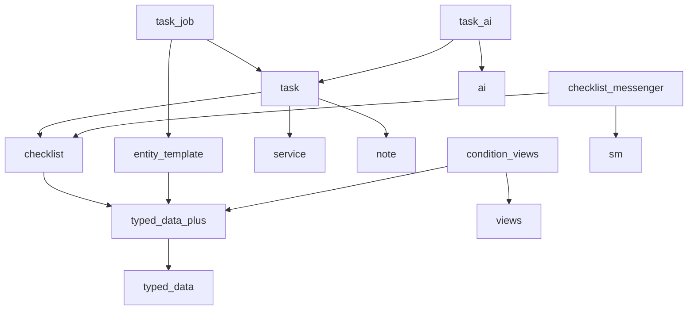

# Phase 0: workflow contracts and port inventory

Status: design baseline, 16 September 2026. No runtime implementation is claimed.
Read with [the architecture](WORKFLOW_ARCHITECTURE.md) and
[implementation plan](WORKFLOW_IMPLEMENTATION_PLAN.md). This record owns P0's
source inventory, migration boundaries and requirements-to-tests mapping.

## Evidence and scope

CounselKit sources below are from `origin/11.5.x`, commit `d9f66a2ce9`, beneath
`sites/all/modules/counselkit/`. They were read from that revision, not the local
11.4 working tree. Common baseline is `59faa44` on `2.x`. Entity Template callers
were inspected in the consumer installation of `drupal/entity_template`
`1.0.0-alpha17`, alongside `drupal/typed_data` `2.1.1`.

“Adapt” means preserve the behavior using Drupal 10/11 services, typed data,
plugins and access results. It does not mean copying the D7 wrappers. Test IDs
below are planned acceptance scenarios, not names of tests already passing.

## Port inventory and ownership

Paths in this table are relative to the CounselKit module directory above.

| Contract / source | Disposition and target | Acceptance scenario |
| --- | --- | --- |
| `ck_task/ck_task.entity.inc`, task processing, dates, dependencies, assignment and contexts | Adapt to `task`; preserve task root separately from service root | T01: future start stays pending; due/external deadline do not silently activate or resolve work; only resolved prerequisites release it |
| `ck_service/includes/service.entity.inc`, `ck_service.info.inc` | Adapt to `service`; draft, active, complete, cancelled, superseded | T02: immediate draft service keeps tasks pending; active immediate service permits execution despite draft or terminal ancestors; parent transitions do not cascade; cancellation and supersession emit distinct events |
| `ck_task/modules/job/ck_task_job.entity.inc` and job triggers | Adapt to `task_job`; config-driven jobs and assignment rules | T03: repeated trigger handling does not duplicate work; explicit assignment is preserved; rules recheck access |
| `ck_task/includes/checklist_item/interface.item_plugin.inc`, `base.item_plugin.inc`, `action_result.item_plugin.inc` | Adapt to `checklist`; action, form and structured action result contracts | T04: action/form/operation have equivalent domain effects and gates |
| `interface.action_operations.inc`, `trait.action_operations.inc`, `action_operation_result.inc` in the same directory; `ck_task/includes/ck_task.checklist_routes.inc` | Adapt to `checklist`; discoverable schema-defined operations and API adapter | T05: schema validation and denied operations leave state/outcomes unchanged |
| `interface.outcome.inc`, `interface.outcome_set.inc`, `task_checklist_item.outcome_set.inc`, `task.outcome_set.inc` in that directory | Adapt to `checklist`; task exposes item outcome contexts without duplicating storage | T06: expected definitions exist before execution; actual values update dependent contexts |
| `interface.needs_state.inc`, `checklist_item_state.inc`; `ck_task/ck_task.checklist_item.entity.inc` | Adapt to `checklist`; change failure cleanup policy as specified below | T07: success cleanup, failed-state retention, resume, reset and concurrent version rejection |
| `ck_task/ck_task.checklist.inc`, `ck_task/ck_task.entity.inc::processChecklist()` | Adapt to `checklist` processor plus `task` host adapter | T08: applicability, requiredness, dependencies, completion condition, queued/failed/contested work and changed outcomes |
| `ck_task/src/Process/ProcessContext.php`; item entity action/queue/run-as paths | Adapt to `checklist`; immutable execution context scoped to one invocation | T09: same executor in browser and worker has distinct viewer context; identity always restored on exception |
| `ck_task/src/Plugin/ChecklistItemProvider/*`; `ck_task/modules/job/src/Plugin/ChecklistItemProvider/{JobChecklistItemProvider,IterateChecklistItemProvider}.php` | Adapt generic providers to `checklist`, job providers to `task_job` | T10: database, virtual, job and iteration sources compose deterministically |
| `ck_task/src/DerivativeItems/*` including scope, name rewriting, subtree queries, resolver and orphan reconciler | Adapt to `checklist`; retain algorithms where independent of D7 | T11: nested expansion, stable identities, dependency rewriting, recursion limit and orphan restoration |
| `decision.item_plugin.inc`, `decision_options.item_plugin.inc` | Adapt to `checklist`; named options, availability and derivative templates | T12: a decision adds required work; unavailable options cannot be invoked via API |
| `manual.item_plugin.inc`, `wait_for_condition.item_plugin.inc`, `new_chained_task.item_plugin.inc` | Adapt generic manual/wait to `checklist`, task creation to `task` | T13: manual fallback, delayed condition recheck and idempotent chained-task creation |
| `multiple_submission_form.item_plugin.inc`, `process_queue.item_plugin.inc`, `rules_component.item_plugin.inc` | Defer specialized adapters; inventory configuration consumers before migration | T14: unsupported plugin IDs yield actionable configuration errors, never silent completion |
| `ck_task/ck_task.checklist_ui.inc`, `ck_task/ck_task.checklist_ui.ajax.inc`, base plugin action-resource methods | Adapt to optional checklist UI; generic resource pane, shared keys and refresh | T15: decision expansion refreshes both panes; resource access/cache metadata and keyboard focus preserved |
| `ck_task/ck_task.module::ck_task_cron_queue_info()`, `ck_task_process_task_checklist_item_action()`, `ck_task_process_task_process_checklist()` | Adapt to dispatch contract and optional Messenger adapter | T16: cron and worker share execution gates; only one consumer owns each queue |
| `ck_task/ck_task.checklist_item.entity.inc` action/completion/failure metadata | Adapt and extend in `checklist`; durable attempt/event history | T17: transitions record initiator, executor, timestamps, method and failure without exposing restricted state |
| `ck_opencrm/src/ConditionString/*`, `ck_opencrm/src/Plugin/ConditionSetEvaluator/ConditionString.php` | Adapt parser/diagnostics to TypedDataPlus; replace D7 metadata traversal with filtered data fetcher | T18: grammar, reference diagnostics, missing values and typed comparison parity |
| Same evaluator: Views and checklist predicates | Adapt Views to optional low-level integration; item predicates registered by checklist/task | T19: contextual/exposed arguments, access, counts and cache isolation across users and changed data |
| `ck_ai/src/AIRunRepository.php`, `AISessionContext.php`, `AITransportSelector.php`; task `async_ai_run.trait.inc` | Adapt durable task/item sessions and runs to optional AI integration; reuse Drupal AI providers | T20: multi-request continuation, short wait, cancellation and duplicate/late result rejection |
| D7 provider-specific HTTP integrations, Node transport | Defer replacement until P8 proves provider parity; do not port Node stack as a dependency | T21: provider call longer than FPM timeout completes in CLI and resumes through persisted run |
| Phone/chat resources and configurable recovery workflows | Exclude from this port | T22: install and run reference workflow without those modules |
| Existing Common note module | Reuse for task comments; host access adapter in task | T23: comments respect task access; no duplicate comment entity |
| Common `ServiceReferenceItem` parent/root/all traversal | Adapt for nested services | T24: tree cycles, orphan parents, concurrent reparent, descendant cache invalidation and denied cross-scope moves |

The inventory covers shared contracts, not every CounselKit business plugin.
Legal, telephone, chat and browser-provider plugins remain application adapters.
AI Agents and Tool API are candidate adapters, not required checklist dependencies.

## Data fetcher extraction and dependency boundary

Proposed dependency direction (arrows mean “depends on”):



New adapter/module names here are design labels, not published packages. Keep the
existing `typed_data_reference` and `typed_data_context_assignment` module IDs
inside the single `rlmumford/typed_data_plus` Composer package. Add the low-level
fetcher/evaluator there; no dependency back to Entity Template, task or checklist.
The task Composer package currently requires Entity Template because it ships
`task_job`; this packaging edge is acceptable and distinct from enabling the
Entity Template module for the base task module.

| Entity Template source | Migration contract | Planned proof |
| --- | --- | --- |
| `src/DataFetcher.php` | Move filtered traversal to an explicit extended interface; preserve typed-return and value-return APIs | T25: nested/list paths, filter chains, null handling, quoted/delimited arguments and typed definitions |
| `src/EntityTemplateServiceProvider.php` | Coordinate removal/delegation of its overrides of `typed_data.data_fetcher` and `typed_data.placeholder_resolver`; do not rely on service-provider ordering | T26: container builds with either/both modules; one authoritative fetcher |
| `src/PlaceholderResolver.php` | Delegate to shared fetching/filtering; keep placeholder escaping and missing-data semantics | T27: HTML escaping, trusted Markup, missing values and bubbleable metadata |
| `src/Template/DataFilterTwigExtension.php` | Inject extended interface instead of calling extra methods on the base interface | T28: Twig and condition paths return equivalent filtered values |
| `src/Plugin/EntityTemplate/Component/DataSelectComponentTrait.php` and field-data selection | Migrate callers without changing saved property paths; add component conditions using shared evaluator | T29: old template config still evaluates; unmet component condition prevents execution |
| `src/Plugin/TypedDataFilter/*`: date_add, date_sub, option_label, format_field | Shared filters retain IDs; rendering-specific code retains access/cache semantics and optional dependencies | T30: date shapes, wrapped field lists, successive typed/raw transforms, formatter access and cache metadata |

The installed fetcher feature-detects `usesWrappedValue()` beyond the released
Typed Data filter interface. Define and test that extension deliberately. Its
argument parser uses splitting/regular expressions: do not advertise a complete
quoted-expression grammar without tests. Keep compatibility wrappers/deprecations
for existing PHP consumers in a coordinated Entity Template release. Do not ship
two classes registering the same filter ID. Root Composer repositories must list
GitHub packages; dependent packages' repository declarations are not inherited.
Drupal.org publication remains deferred.

Condition grammar inventory: `never`, `passes`, `view`, `exists`, `empty`, `with`,
`contains`/`notcontains`, `in`/`notin`, equality/order/`matches`, `isroot`,
`complete`, `failed`, `auto`, `applicable`, `skipped`, `required`, `is`, `has`, and
boolean grouping/negation. Preserve parser and semantic diagnostics separately
from runtime evaluation. `passes` currently delegates to Rules: reserve the
syntax and provide a predicate extension; unsupported Rules references must fail
configuration validation until an adapter or explicit migration exists. Do not
introduce Rules as a mandatory dependency. Views checks include contextual
arguments and exposed filters; evaluate with the declared executor and access
policy, with evaluation-scoped caching only. A configuration error is distinct
from a valid false condition and must prevent automatic completion.

## Lifecycle decisions

The user confirmed immediate-service-only gating and retention of intermediate
state on failure with separate attempts for explicit resume or start-fresh.
Start-fresh clears working state while preserving history.

### Task and service

- Persist task lifecycle intent and compute readiness separately. Preserve existing
  field names `start`, `due`, `deadline`, `resolved`, `dependencies`, `service`
  where present; verify actual schema before adding or renaming any field.
- Readiness precedence: terminal task state first; otherwise future start or a
  draft immediate service means pending; otherwise manual hold, unresolved/missing
  dependency or non-active immediate service means blocked; otherwise active. Return all
  reasons as well as the primary state. A task without a service has no service gate.
- Only `resolved` satisfies a task dependency. Existing Common also accepts
  `closed`; remove that behavior with a migration/release note, not a silent alias.
  Keep closed as a distinct terminal disposition for legacy records.
- All writes entering resolved set the resolution timestamp, including direct API
  saves. Reopening clears the current timestamp but keeps historical events.
  Due date and external deadline inform scheduling/reporting, not completion.
- Service states are `draft`, `active`, `complete`, `cancelled`, `superseded`.
  Draft can activate/cancel/supersede; active can complete/cancel/supersede.
  Reopening a terminal service is an explicit authorized transition with history.
  Supersession has its own event, never the cancellation event by alias.
- Parent transitions do not mutate descendant statuses unless an explicit workflow
  changes them. Only the immediate service gates task execution: draft, complete,
  cancelled or superseded ancestors do not independently gate descendant tasks.
  Already resolved tasks retain their outcome. Completion of a parent need not
  complete children: installations may register a stricter completion policy.
- Keep the existing service-to-service `service` field as parent. `all` is ordered
  immediate referenced service to root, inclusive; `root` is the last ancestor.
  An empty reference has no root. A service's own hierarchy API includes itself
  when requesting its root/ancestry; document the distinction from its parent field.
- Refuse deletion with dependent children/tasks by default. Reparent requires
  cycle-safe traversal, access/scope validation, and serialized validation/write
  to prevent concurrent moves creating a cycle. Missing parents/cycles produce a
  diagnostic and block execution; they cannot loop indefinitely.
- No inherited manager, recipients or permissions. Optional assignment fallback
  is a separate policy. Organization boundaries are supplied by a scope policy;
  no CounselKit firm or Christian Jobs staff-role dependency belongs in Common.
- Common's old boolean `state` means only “Active?”. True can map to active;
  false does not distinguish draft/complete/cancelled. Preserve the original value
  and require an explicit migration mapping for inactive records before enabling
  new processing. Do not guess historical meaning or discard unresolved records.

### Checklist item, attempt and working state

An item's durable completion disposition is open, complete, skipped or failed;
applicability, requiredness and readiness are evaluated facts. Queued/running/
waiting belong to attempts, not independent contradictory flags on the item.
Skipped satisfies completion only under the configured completion policy.
Orphaned items are retained and excluded from the active provider set; restoring
one preserves its identity, state, history and outcomes.

Attempt transitions: queued → running → waiting/running → succeeded/failed/
cancelled. Waiting is durable and releases the worker. A failed attempt remains
failed; explicit resume creates a successor attempt referencing retained state.
Start-fresh creates a successor with empty working state. Transport redelivery
continues the same attempt and is not a user retry. Reset/reopen records an event,
invalidates outstanding attempts and explicitly invalidates current outcomes;
previous values remain in restricted history under the retention policy.

Working state is item-scoped by default, versioned and opt-in; it is not outcomes
and is not implicitly per-viewer. Clear on success; retain on failure for explicit
resume/reset. Do not automatically dump it into ordinary outcomes. Restricted,
redacted diagnostic snapshots may be retained separately. Item/history/state
access must be no broader than host access. Retention is configurable; operational
history records references and transitions without requiring permanent raw prompts
or sensitive state dumps.

Claims use atomic storage/version checks and bounded leases. Every state/outcome
write carries the active attempt and version; expired/cancelled/superseded attempts
cannot apply late results. Lease expiry alone cannot prove an external side effect
did not happen: use idempotency keys/reconciliation or require operator inspection.
Concurrent edits invalidate stale evaluation; no silent last-write-wins for action
results. Completion reloads and checks the current provider set, including newly
generated required items, under the completion/processing lock.

### Execution context and public extension points

Keep initiator, executor, viewer/audiences, origin and attempt identity distinct.
Background processing has no interactive viewer even when the account switcher
selects a user. Recheck the user's current status, permissions and execution policy
when claiming and before applying results. Reassignment requires policy
re-evaluation; do not blindly continue as the old assignee. Scope account switching
and any ambient process context with `finally` cleanup for long-lived workers.

Public contracts required before implementations depend on them:

- Typed fetcher, filter extension, condition predicate/reference resolver and
  validation/explanation result, including cacheability.
- Checklist host/context provider; plugin action/form/operation interfaces;
  expected outcomes, state capability and structured results.
- Item provider, derivative template resolver and stable scoped identity;
  resource definition/provider and refresh result.
- Readiness, assignment, execution identity, service transition/completion and
  organization scope policies; access decisions remain enforced by each adapter.
- Attempt repository/claim API, dispatch transport, after-commit evaluation/outbox,
  continuation scheduler and idempotency context.
- Optional AI run/session repository and provider/tool adapters.

No automatic fallback to privileged user 1. No serialized entity snapshots in
queue messages. Task-save evaluation uses a durable after-commit outbox/coalescing
contract; processing a save must not lose a later wakeup or dispatch recursively.
Independent items can run concurrently; shared resources can opt into serialization.

## Architectural review findings

The local architect review identified four design requirements now incorporated:

- Preserve property paths and coordinate fetcher replacement instead of depending
  on module load order (T25–T30).
- Separate background execution identity from viewer audiences (T09).
- Keep working state, outcomes and history distinct, with explicit retry semantics
  and host-scoped access (T07, T17).
- Put organization boundaries behind validated policies; nesting grants no implicit
  access (T24).

No application-specific firm, district, legal or staff-role assumptions are added.
The remaining migration risk is inactive legacy services: resolution requires a
consumer-supplied mapping during P2, not another framework state invented in P0.

## Compatibility evidence and remaining proofs

See [the compatibility probe](probes/workflow-composer.json) for exact candidate
constraints. Run it in an empty temporary directory with Composer, not as an update
to a consuming application. The probe disables plugins and does not install code:

```sh
cp /path/to/docs/probes/workflow-composer.json composer.json
composer update --no-install --no-scripts --no-interaction
```

The baseline deliberately uses PHP 8.3 and Drupal 10.6. Optional Messenger 0.2.0
requires PHP >=8.2 and Drupal ^10.5 or ^11.2; AI/Tool also constrain the core range.
This is a candidate integration baseline, not a unilateral increase to every
existing Common package's supported versions. PHP 8.1 consumers must upgrade before
enabling that integration stack.

Executed in DDEV with Composer on 16 September 2026. The actual PHP runtime was
8.1.34; `config.platform.php` simulated the candidate solver platform. No candidate
PHP 8.3 code was executed. Both accepted runs used stable transitive dependencies,
with the explicitly pinned alpha/beta root packages allowed.

| Probe | Result |
| --- | --- |
| PHP platform 8.3.0, core `~10.6.0`, pinned integration packages in fixture | Resolved Drupal 10.6.16; Composer reported no security advisories |
| PHP platform 8.3.0, change core constraint to `^11.2` | Resolved Drupal 11.4.6; Composer reported no security advisories |
| PHP platform 8.1.29, same integration package pins | Rejected: Messenger and Tool require PHP >=8.2 |
| Initial exploratory core `~11.2.0` with development stability allowed | Selected 11.2.x-dev and reported advisories; discarded as a baseline |

To repeat the second probe, change only `require.drupal/core` to `^11.2` in a
fresh copy. For the negative probe, change only `config.platform.php` to `8.1.29`.
The fixture resolves upstream dependencies, not Common's complete consumer graph;
the independent Common install/upgrade matrix is P9. Floating patch constraints
mean future resolution can differ; these are observations, not a committed lock.

Dependency resolution does not prove module installation, API compatibility,
container compilation, provider timeout behavior or durable processing. Those
remain explicit P1/P7/P8/P9 acceptance work. In particular AI Agents/Tool are
candidates, and AI Runtime/Runner remain deferred until their API and lifecycle
contracts are validated. No claim of exactly-once external effects is made.

## Phase handoff

P0 has assigned the agreed scope to packages and planned tests, specified lifecycle
and extension boundaries, and identified the coordinated Entity Template release.
P1 starts with the extended fetcher interface and compatibility fixtures, then the
condition grammar/registry. P2 must resolve legacy inactive records through an
explicit upgrade policy. Implementers must turn T01–T30 into executable coverage
in their owning phases; this document does not count as that coverage.
